# Pooled Results

  
## Cumulative incidence of stunting from birth to 24 months  
  
### Child characteristics  
  
#### Birth length  
reference level: <=46.8   
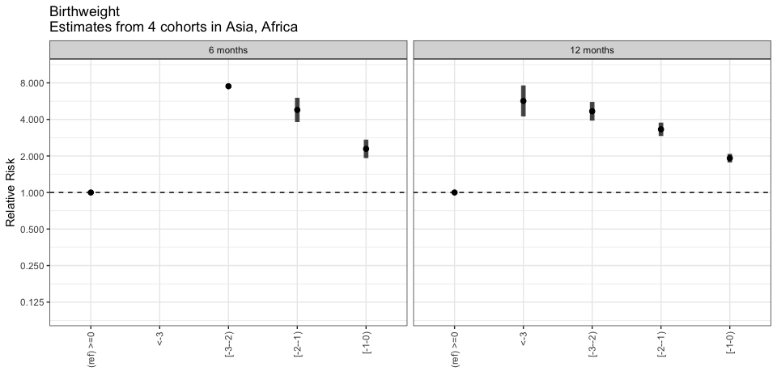<!-- -->  
  
#### Birthweight  
reference level: <=2600   
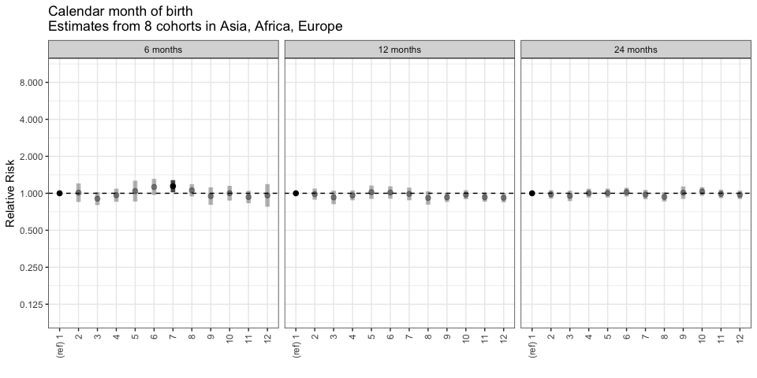<!-- -->  
  
#### Calendar month of birth  
reference level: 1   
<!-- -->  
  
#### Calendar month of measurement  
reference level: 1   
<!-- -->  
  
#### Child delivered at home  
reference level: 0   
<!-- -->  
  
#### Child's sex  
reference level: NA   
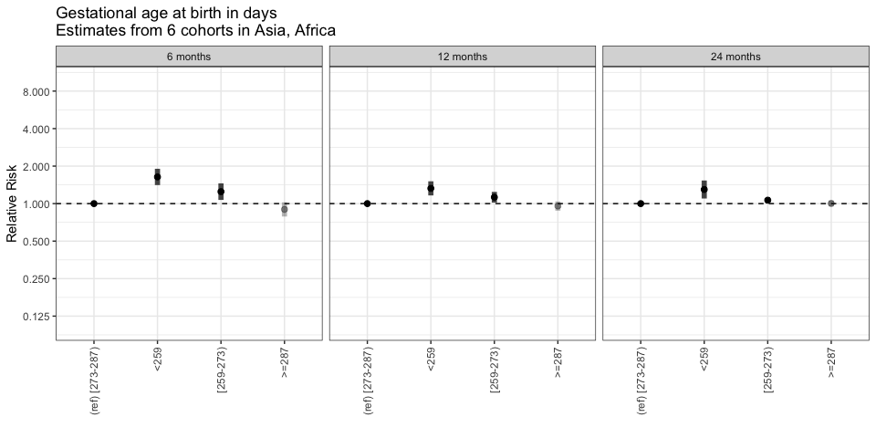<!-- -->  
  
#### Stunted at enrollment  
reference level: 0   
<!-- -->  
  
#### Vaginal delivery  
reference level: 0   
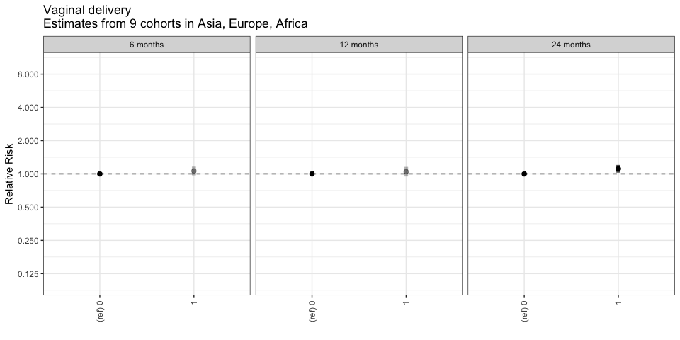<!-- -->  
  
  
### Household characteristics  
  
#### Asset based wealth index  
reference level: Wealth Q1   
<!-- -->  
  
#### nchldlt5  
reference level: 1   
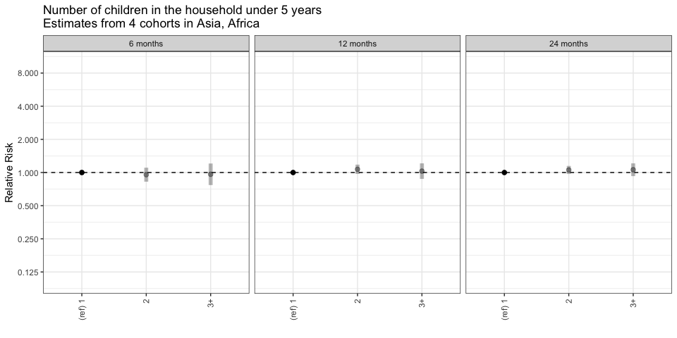<!-- -->  
  
#### nhh  
reference level: 3 or less   
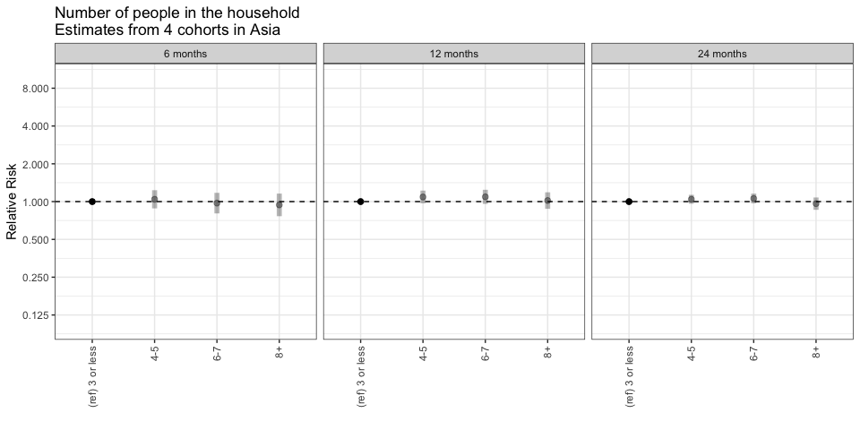<!-- -->  
  
#### Number of rooms in household  
reference level: 1   
<!-- -->  
  
#### USAID Household Food Insecurity Access Scale (HFIAS) category  
reference level: Food Secure   
<!-- -->  
  
  
### Maternal characteristics  
  
#### Gestational age at birth  
reference level: <=266   
<!-- -->  
  
#### Maternal age  
reference level: <=20   
<!-- -->  
  
#### Maternal BMI  
reference level: <=18.7   
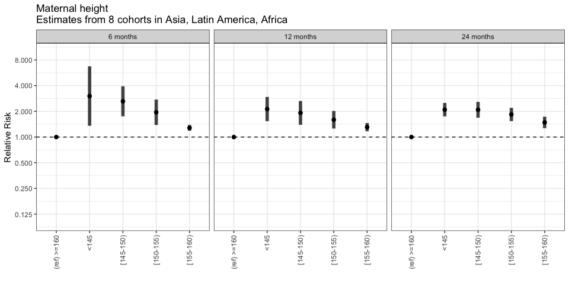<!-- -->  
  
#### Maternal height  
reference level: <=149.6   
<!-- -->  
  
#### Maternal parity  
reference level: 1   
<!-- -->  
  
#### Maternal weight  
reference level: <=42.4   
<!-- -->  
  
#### Mother is unmarried  
reference level: 0   
<!-- -->  
  
#### Mother's education  
reference level: Q1   
<!-- -->  
  
  
### Paternal characteristics  
  
#### Father age  
reference level: <=24   
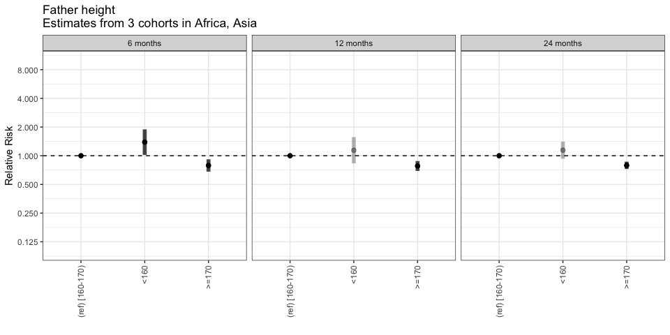<!-- -->  
  
#### Father's education  
reference level: Q1   
<!-- -->  
  
  
  
## Point prevalence of severe stunting  
  
### Child characteristics  
  
#### Birth length  
reference level: <=46.8   
<!-- -->  
  
#### Birthweight  
reference level: <=2600   
<!-- -->  
  
#### Calendar month of birth  
reference level: 1   
<!-- -->  
  
#### Calendar month of measurement  
reference level: 1   
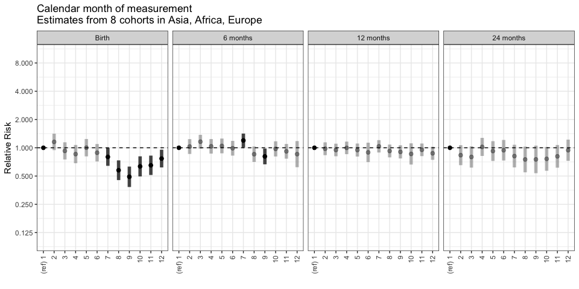<!-- -->  
  
#### Child delivered at home  
reference level: 0   
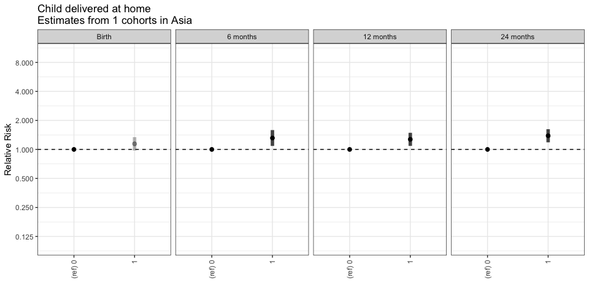<!-- -->  
  
#### Child's sex  
reference level: NA   
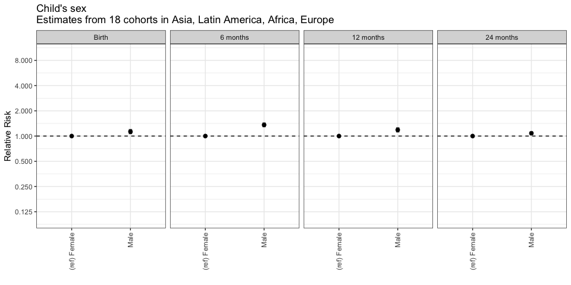<!-- -->  
  
#### Stunted at enrollment  
reference level: 0   
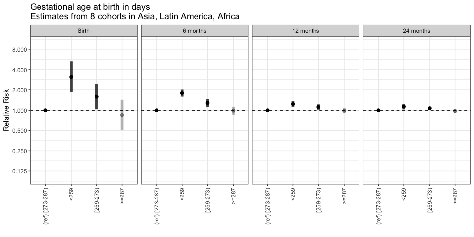<!-- -->  
  
#### Vaginal delivery  
reference level: 0   
<!-- -->  
  
  
### Household characteristics  
  
#### Asset based wealth index  
reference level: Wealth Q1   
<!-- -->  
  
#### nchldlt5  
reference level: 1   
<!-- -->  
  
#### nhh  
reference level: 3 or less   
<!-- -->  
  
#### Number of rooms in household  
reference level: 1   
<!-- -->  
  
#### USAID Household Food Insecurity Access Scale (HFIAS) category  
reference level: Food Secure   
<!-- -->  
  
  
### Maternal characteristics  
  
#### Gestational age at birth  
reference level: <=266   
<!-- -->  
  
#### Maternal age  
reference level: <=20   
<!-- -->  
  
#### Maternal BMI  
reference level: <=18.7   
<!-- -->  
  
#### Maternal height  
reference level: <=149.6   
<!-- -->  
  
#### Maternal parity  
reference level: 1   
<!-- -->  
  
#### Maternal weight  
reference level: <=42.4   
<!-- -->  
  
#### Mother is unmarried  
reference level: 0   
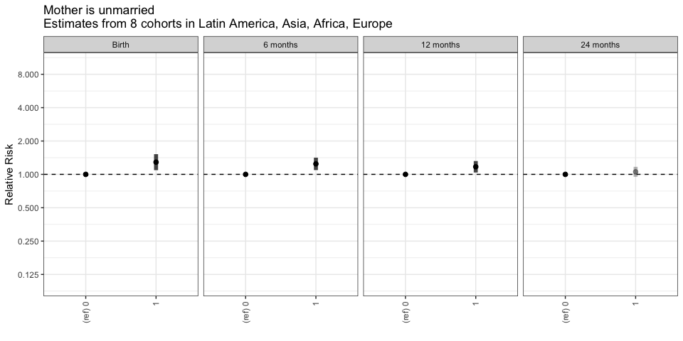<!-- -->  
  
#### Mother's education  
reference level: Q1   
<!-- -->  
  
  
### Paternal characteristics  
  
#### Father age  
reference level: <=24   
<!-- -->  
  
#### Father's education  
reference level: Q1   
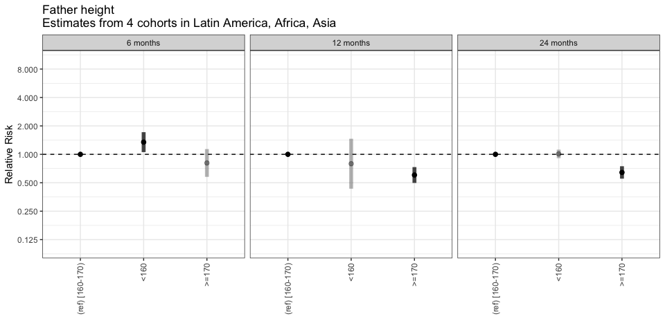<!-- -->  
  
  
  
## Point prevalence of stunting  
  
### Child characteristics  
  
#### Birth length  
reference level: <=46.8   
<!-- -->  
  
#### Birthweight  
reference level: <=2600   
<!-- -->  
  
#### Calendar month of birth  
reference level: 1   
<!-- -->  
  
#### Calendar month of measurement  
reference level: 1   
<!-- -->  
  
#### Child delivered at home  
reference level: 0   
<!-- -->  
  
#### Child's sex  
reference level: NA   
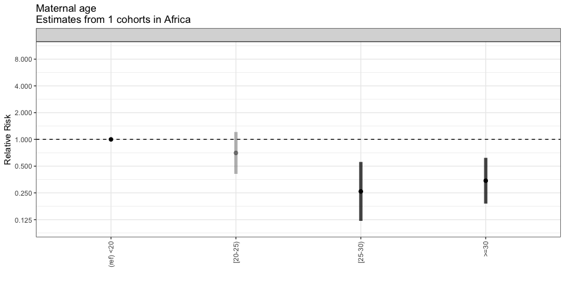<!-- -->  
  
#### Stunted at enrollment  
reference level: 0   
<!-- -->  
  
#### Vaginal delivery  
reference level: 0   
<!-- -->  
  
  
### Household characteristics  
  
#### Asset based wealth index  
reference level: Wealth Q1   
<!-- -->  
  
#### nchldlt5  
reference level: 1   
<!-- -->  
  
#### nhh  
reference level: 3 or less   
<!-- -->  
  
#### Number of rooms in household  
reference level: 1   
<!-- -->  
  
#### USAID Household Food Insecurity Access Scale (HFIAS) category  
reference level: Food Secure   
<!-- -->  
  
  
### Maternal characteristics  
  
#### Gestational age at birth  
reference level: <=266   
<!-- -->  
  
#### Maternal age  
reference level: <=20   
<!-- -->  
  
#### Maternal BMI  
reference level: <=18.7   
<!-- -->  
  
#### Maternal height  
reference level: <=149.6   
<!-- -->  
  
#### Maternal parity  
reference level: 1   
<!-- -->  
  
#### Maternal weight  
reference level: <=42.4   
<!-- -->  
  
#### Mother is unmarried  
reference level: 0   
<!-- -->  
  
#### Mother's education  
reference level: Q1   
<!-- -->  
  
  
### Paternal characteristics  
  
#### Father age  
reference level: <=24   
<!-- -->  
  
#### Father height  
reference level: <=168   
<!-- -->  
  
#### Father's education  
reference level: Q1   
<!-- -->  
  
  

# Appendix 1 - Relative Risk Forest Plots
  
## Cumulative incidence of stunting from birth to 24 months  
  
### Child characteristics  
  
#### Birth length  
reference level: <=46.8   
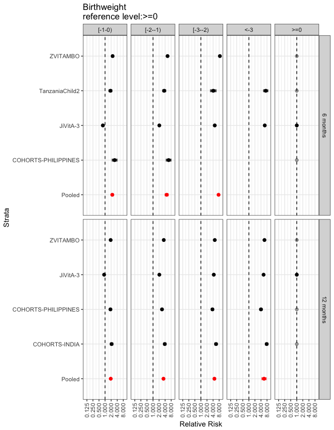<!-- -->  
  
#### Birthweight  
reference level: <=2600   
<!-- -->  
  
#### Calendar month of birth  
reference level: 1   
<!-- -->  
  
#### Calendar month of measurement  
reference level: 1   
<!-- -->  
  
#### Child delivered at home  
reference level: 0   
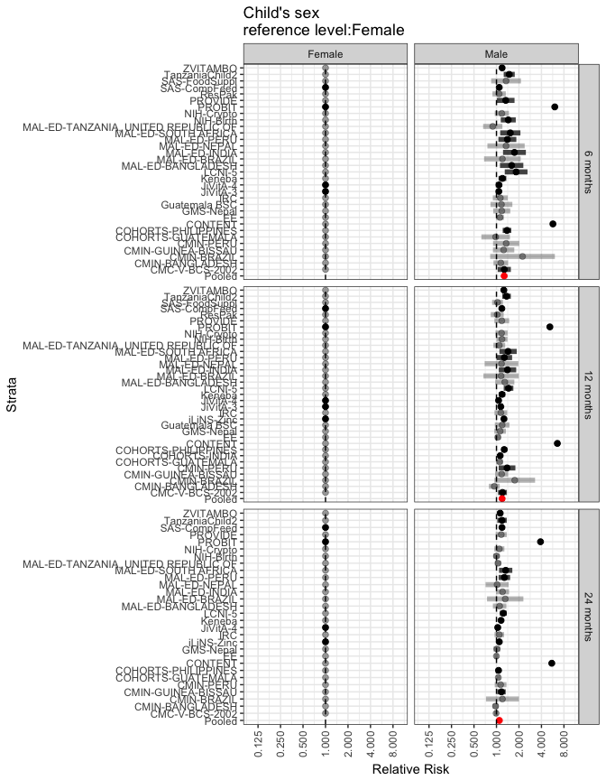<!-- -->  
  
#### Child's sex  
reference level: NA   
<!-- -->  
  
#### Stunted at enrollment  
reference level: 0   
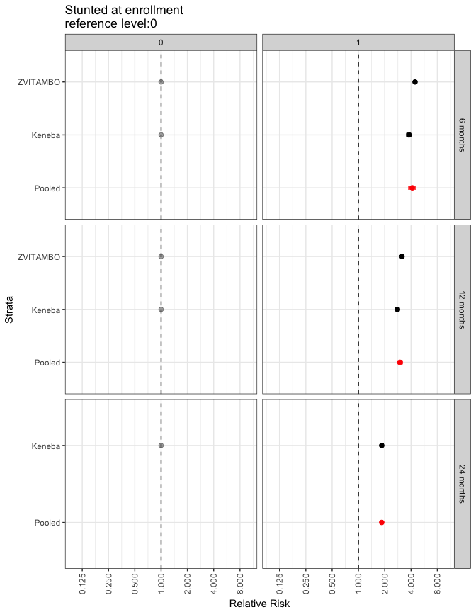<!-- -->  
  
#### Vaginal delivery  
reference level: 0   
<!-- -->  
  
  
### Household characteristics  
  
#### Asset based wealth index  
reference level: Wealth Q1   
<!-- -->  
  
#### nchldlt5  
reference level: 1   
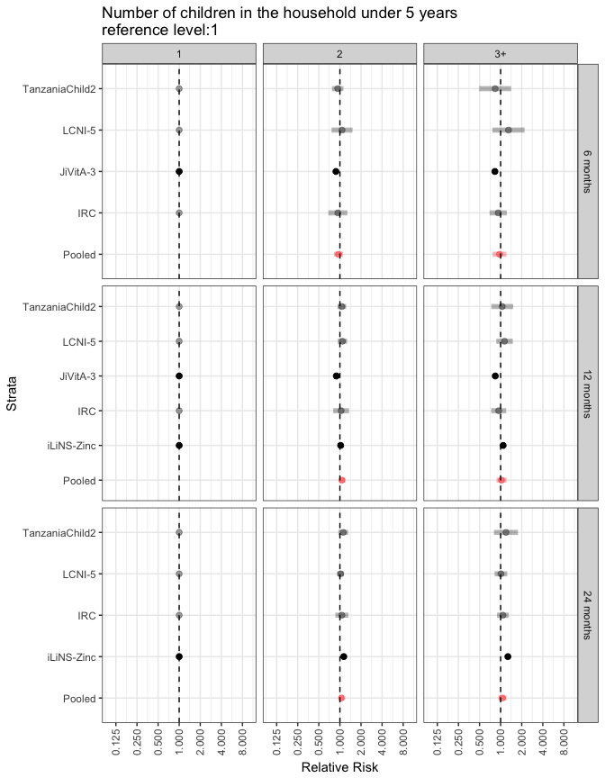<!-- -->  
  
#### nhh  
reference level: 3 or less   
<!-- -->  
  
#### Number of rooms in household  
reference level: 1   
<!-- -->  
  
#### USAID Household Food Insecurity Access Scale (HFIAS) category  
reference level: Food Secure   
<!-- -->  
  
  
### Maternal characteristics  
  
#### Gestational age at birth  
reference level: <=266   
<!-- -->  
  
#### Maternal age  
reference level: <=20   
<!-- -->  
  
#### Maternal BMI  
reference level: <=18.7   
<!-- -->  
  
#### Maternal height  
reference level: <=149.6   
<!-- -->  
  
#### Maternal parity  
reference level: 1   
<!-- -->  
  
#### Maternal weight  
reference level: <=42.4   
<!-- -->  
  
#### Mother is unmarried  
reference level: 0   
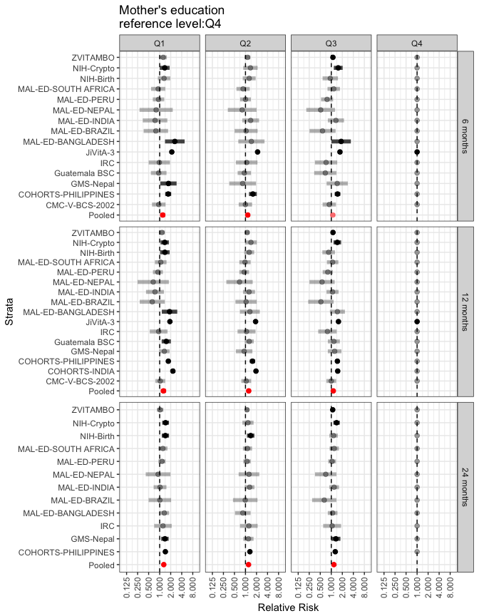<!-- -->  
  
#### Mother's education  
reference level: Q1   
<!-- -->  
  
  
### Paternal characteristics  
  
#### Father age  
reference level: <=24   
<!-- -->  
  
#### Father's education  
reference level: Q1   
<!-- -->  
  
  
  
## Point prevalence of severe stunting  
  
### Child characteristics  
  
#### Birth length  
reference level: <=46.8   
<!-- -->  
  
#### Birthweight  
reference level: <=2600   
<!-- -->  
  
#### Calendar month of birth  
reference level: 1   
<!-- -->  
  
#### Calendar month of measurement  
reference level: 1   
<!-- -->  
  
#### Child delivered at home  
reference level: 0   
<!-- -->  
  
#### Child's sex  
reference level: NA   
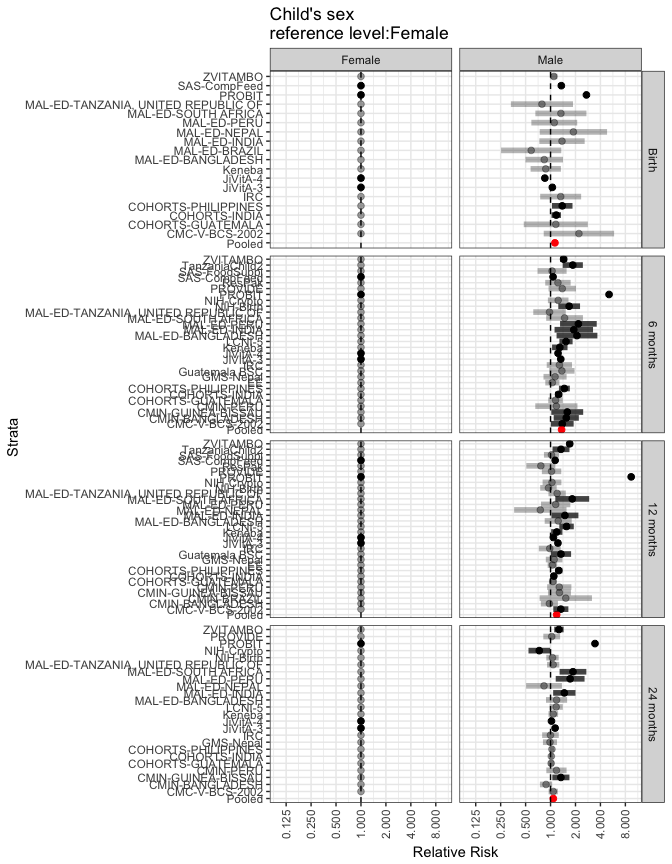<!-- -->  
  
#### Stunted at enrollment  
reference level: 0   
<!-- -->  
  
#### Vaginal delivery  
reference level: 0   
<!-- -->  
  
  
### Household characteristics  
  
#### Asset based wealth index  
reference level: Wealth Q1   
<!-- -->  
  
#### nchldlt5  
reference level: 1   
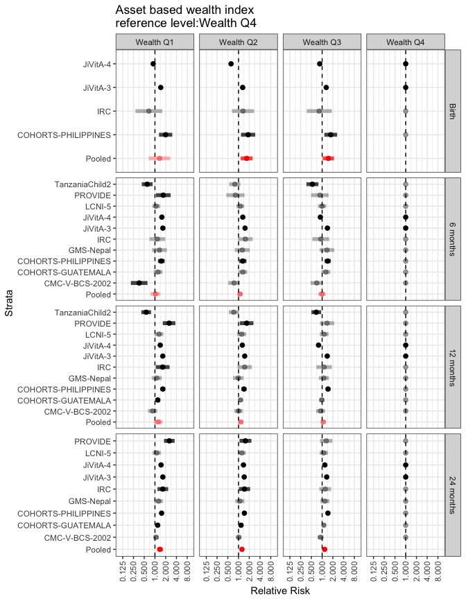<!-- -->  
  
#### nhh  
reference level: 3 or less   
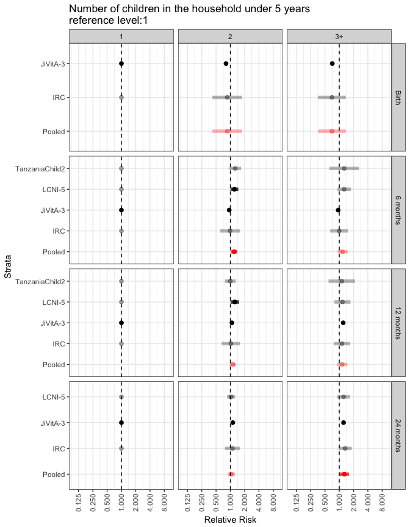<!-- -->  
  
#### Number of rooms in household  
reference level: 1   
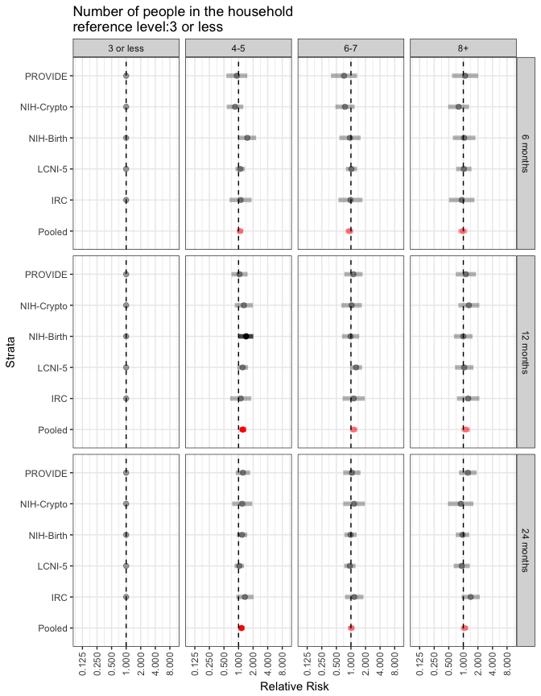<!-- -->  
  
#### USAID Household Food Insecurity Access Scale (HFIAS) category  
reference level: Food Secure   
<!-- -->  
  
  
### Maternal characteristics  
  
#### Gestational age at birth  
reference level: <=266   
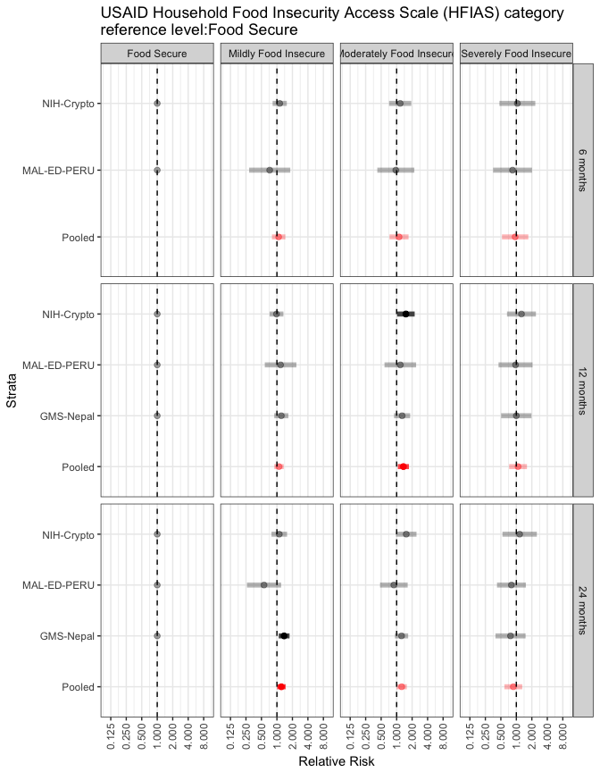<!-- -->  
  
#### Maternal age  
reference level: <=20   
<!-- -->  
  
#### Maternal BMI  
reference level: <=18.7   
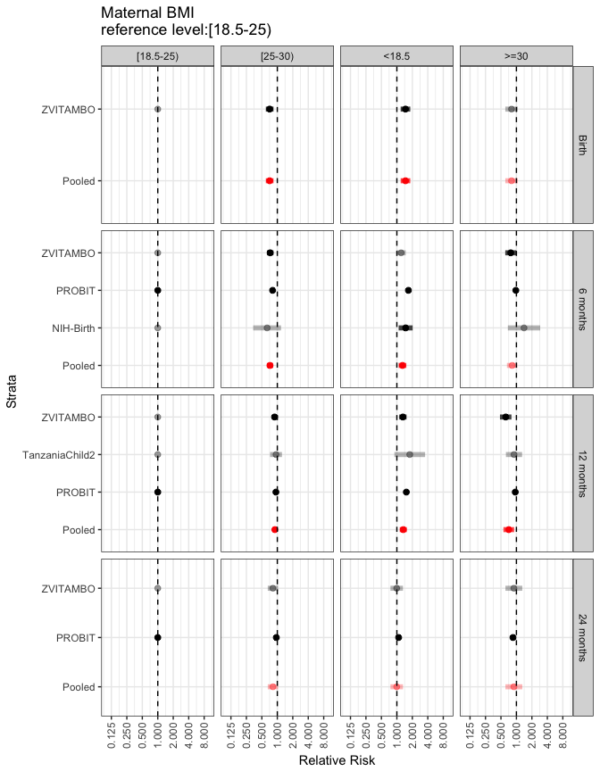<!-- -->  
  
#### Maternal height  
reference level: <=149.6   
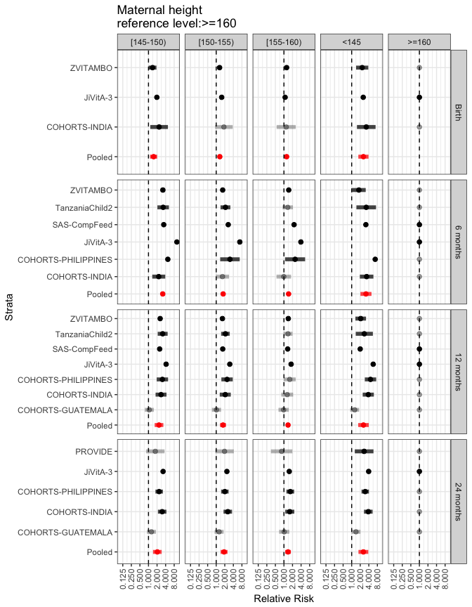<!-- -->  
  
#### Maternal parity  
reference level: 1   
<!-- -->  
  
#### Maternal weight  
reference level: <=42.4   
<!-- -->  
  
#### Mother is unmarried  
reference level: 0   
<!-- -->  
  
#### Mother's education  
reference level: Q1   
<!-- -->  
  
  
### Paternal characteristics  
  
#### Father age  
reference level: <=24   
<!-- -->  
  
#### Father's education  
reference level: Q1   
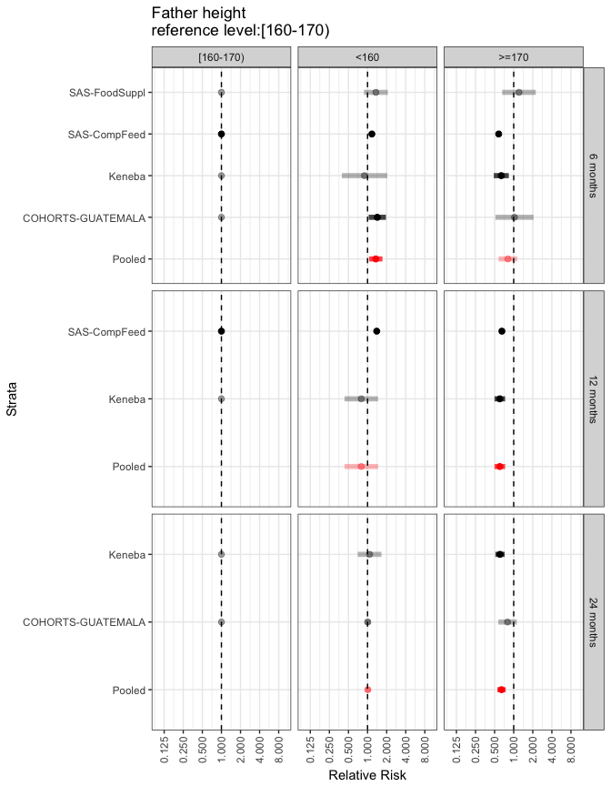<!-- -->  
  
  
  
## Point prevalence of stunting  
  
### Child characteristics  
  
#### Birth length  
reference level: <=46.8   
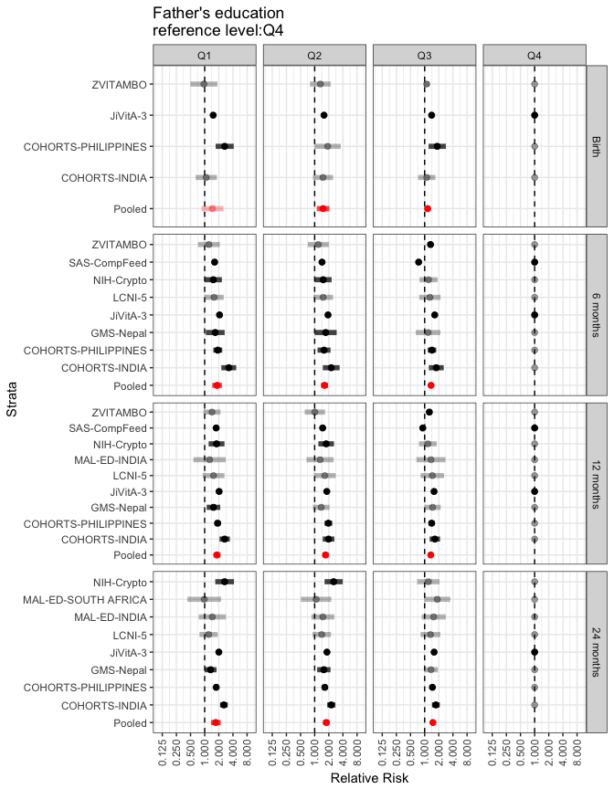<!-- -->  
  
#### Birthweight  
reference level: <=2600   
<!-- -->  
  
#### Calendar month of birth  
reference level: 1   
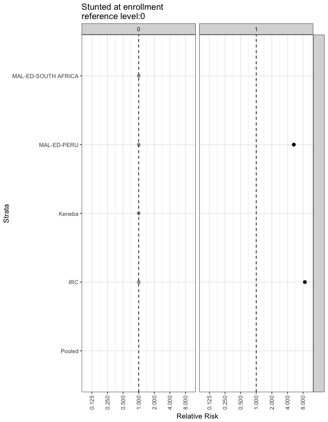<!-- -->  
  
#### Calendar month of measurement  
reference level: 1   
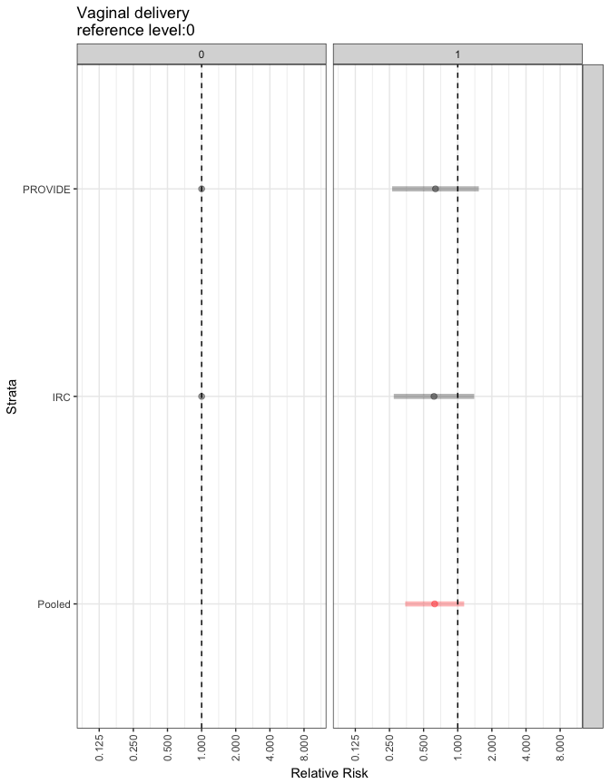<!-- -->  
  
#### Child delivered at home  
reference level: 0   
<!-- -->  
  
#### Child's sex  
reference level: NA   
<!-- -->  
  
#### Stunted at enrollment  
reference level: 0   
<!-- -->  
  
#### Vaginal delivery  
reference level: 0   
<!-- -->  
  
  
### Household characteristics  
  
#### Asset based wealth index  
reference level: Wealth Q1   
<!-- -->  
  
#### nchldlt5  
reference level: 1   
<!-- -->  
  
#### nhh  
reference level: 3 or less   
<!-- -->  
  
#### Number of rooms in household  
reference level: 1   
<!-- -->  
  
#### USAID Household Food Insecurity Access Scale (HFIAS) category  
reference level: Food Secure   
<!-- -->  
  
  
### Maternal characteristics  
  
#### Gestational age at birth  
reference level: <=266   
<!-- -->  
  
#### Maternal age  
reference level: <=20   
<!-- -->  
  
#### Maternal BMI  
reference level: <=18.7   
<!-- -->  
  
#### Maternal height  
reference level: <=149.6   
<!-- -->  
  
#### Maternal parity  
reference level: 1   
<!-- -->  
  
#### Maternal weight  
reference level: <=42.4   
<!-- -->  
  
#### Mother is unmarried  
reference level: 0   
<!-- -->  
  
#### Mother's education  
reference level: Q1   
<!-- -->  
  
  
### Paternal characteristics  
  
#### Father age  
reference level: <=24   
<!-- -->  
  
#### Father height  
reference level: <=168   
<!-- -->  
  
#### Father's education  
reference level: Q1   
<!-- -->  
  
  

# Appendix 2 - Population Attributable Risk Forest Plots

  
## Cumulative incidence of stunting from birth to 24 months  
  
### Child characteristics  
  
#### Birth length  
reference level: <=46.8   
<!-- -->  
  
#### Birthweight  
reference level: <=2600   
<!-- -->  
  
#### Calendar month of birth  
reference level: 1   
<!-- -->  
  
#### Calendar month of measurement  
reference level: 1   
<!-- -->  
  
#### Child delivered at home  
reference level: 0   
<!-- -->  
  
#### Child's sex  
reference level: NA   
<!-- -->  
  
#### Stunted at enrollment  
reference level: 0   
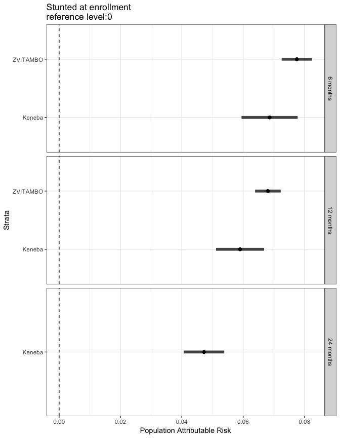<!-- -->  
  
#### Vaginal delivery  
reference level: 0   
<!-- -->  
  
  
### Household characteristics  
  
#### Asset based wealth index  
reference level: Wealth Q1   
<!-- -->  
  
#### nchldlt5  
reference level: 1   
<!-- -->  
  
#### nhh  
reference level: 3 or less   
<!-- -->  
  
#### Number of rooms in household  
reference level: 1   
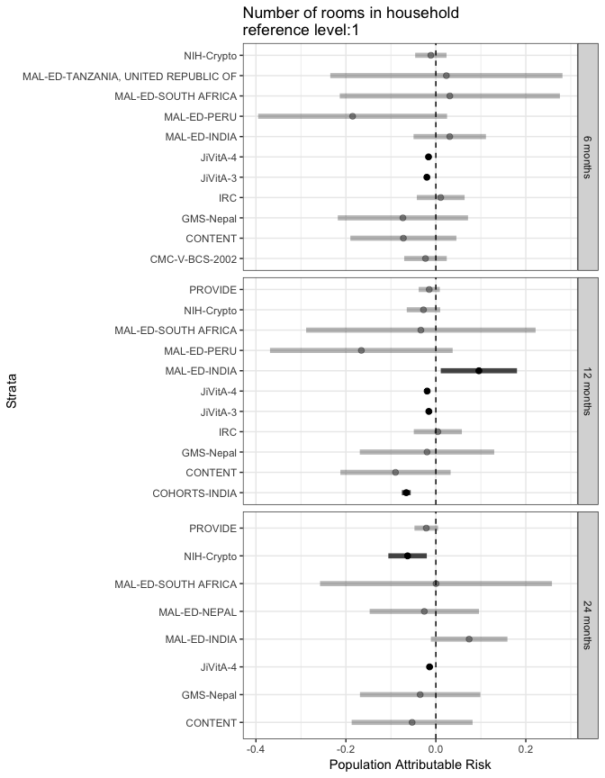<!-- -->  
  
#### USAID Household Food Insecurity Access Scale (HFIAS) category  
reference level: Food Secure   
<!-- -->  
  
  
### Maternal characteristics  
  
#### Gestational age at birth  
reference level: <=266   
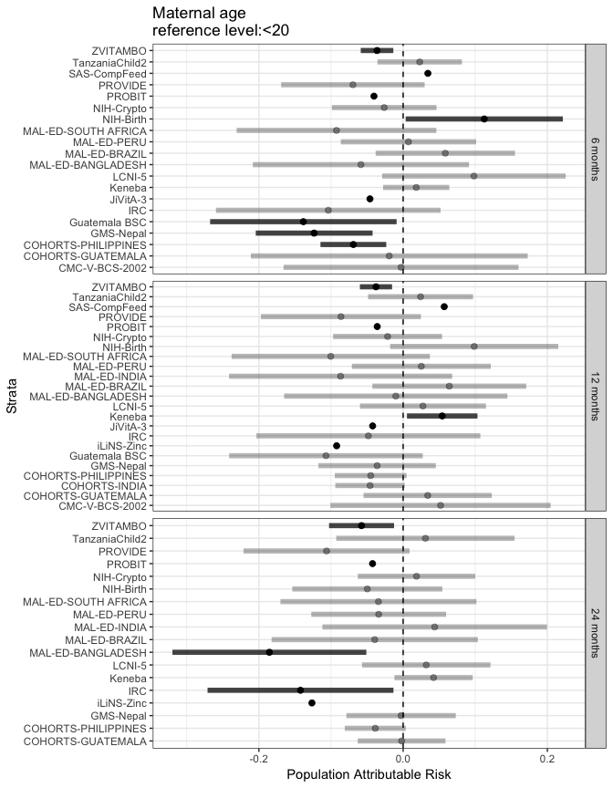<!-- -->  
  
#### Maternal age  
reference level: <=20   
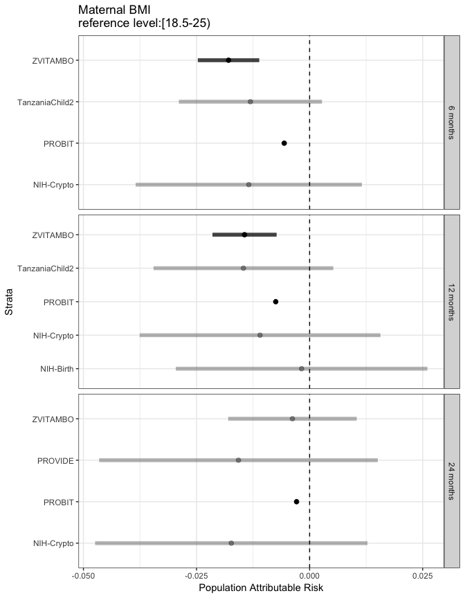<!-- -->  
  
#### Maternal BMI  
reference level: <=18.7   
<!-- -->  
  
#### Maternal height  
reference level: <=149.6   
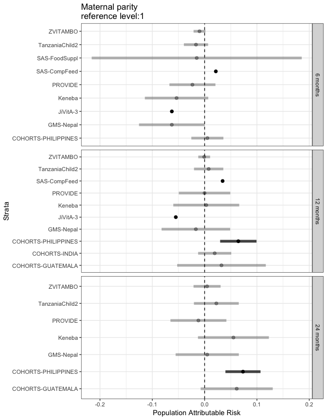<!-- -->  
  
#### Maternal parity  
reference level: 1   
<!-- -->  
  
#### Maternal weight  
reference level: <=42.4   
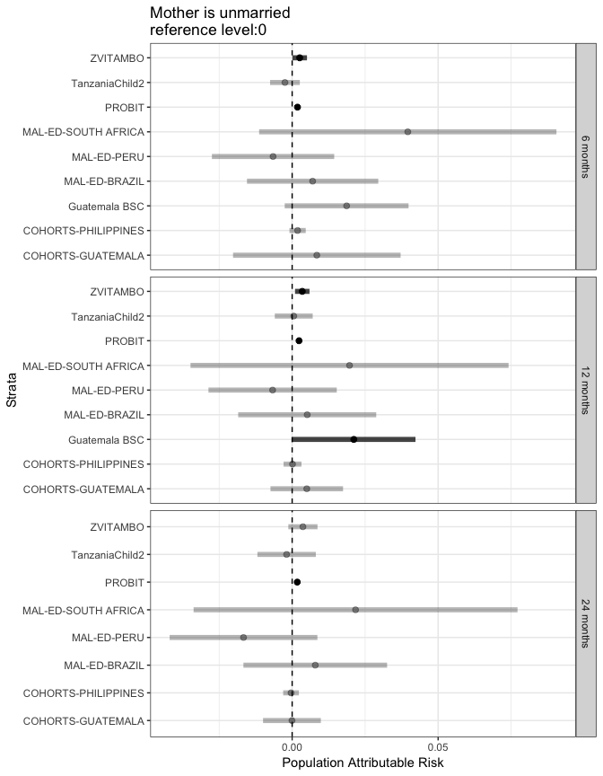<!-- -->  
  
#### Mother is unmarried  
reference level: 0   
<!-- -->  
  
#### Mother's education  
reference level: Q1   
<!-- -->  
  
  
### Paternal characteristics  
  
#### Father age  
reference level: <=24   
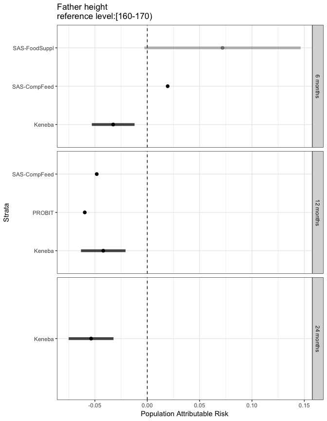<!-- -->  
  
#### Father's education  
reference level: Q1   
<!-- -->  
  
  
  
## Point prevalence of severe stunting  
  
### Child characteristics  
  
#### Birth length  
reference level: <=46.8   
<!-- -->  
  
#### Birthweight  
reference level: <=2600   
<!-- -->  
  
#### Calendar month of birth  
reference level: 1   
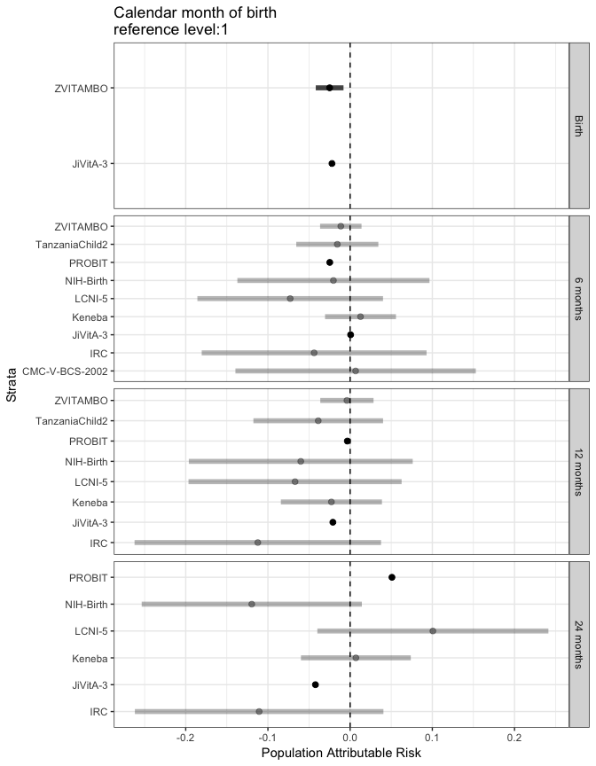<!-- -->  
  
#### Calendar month of measurement  
reference level: 1   
<!-- -->  
  
#### Child delivered at home  
reference level: 0   
<!-- -->  
  
#### Child's sex  
reference level: NA   
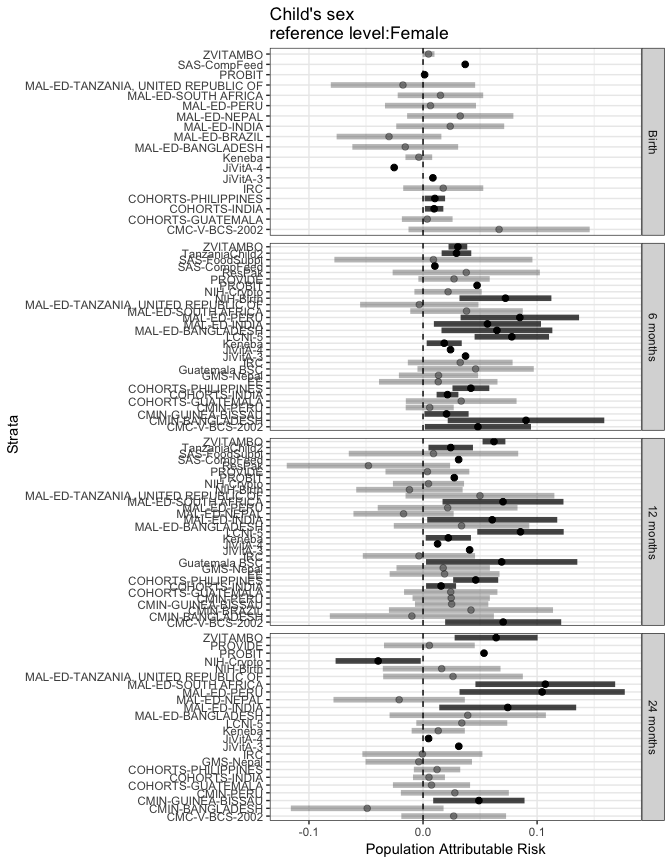<!-- -->  
  
#### Stunted at enrollment  
reference level: 0   
<!-- -->  
  
#### Vaginal delivery  
reference level: 0   
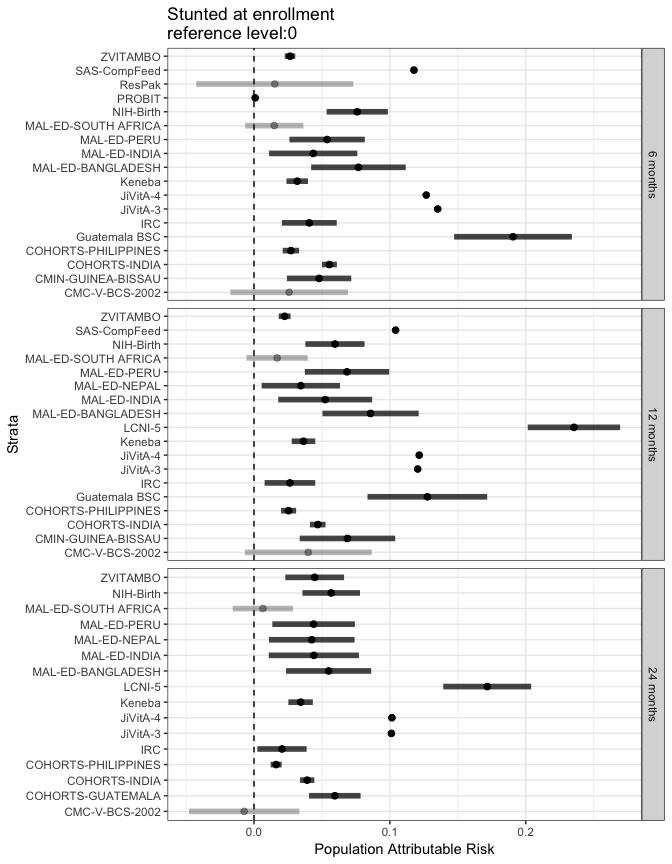<!-- -->  
  
  
### Household characteristics  
  
#### Asset based wealth index  
reference level: Wealth Q1   
<!-- -->  
  
#### nchldlt5  
reference level: 1   
<!-- -->  
  
#### nhh  
reference level: 3 or less   
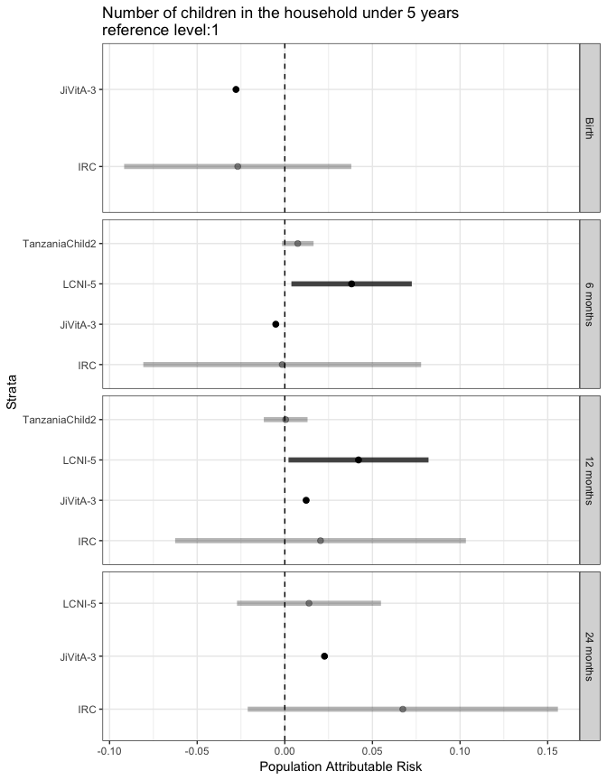<!-- -->  
  
#### Number of rooms in household  
reference level: 1   
<!-- -->  
  
#### USAID Household Food Insecurity Access Scale (HFIAS) category  
reference level: Food Secure   
<!-- -->  
  
  
### Maternal characteristics  
  
#### Gestational age at birth  
reference level: <=266   
<!-- -->  
  
#### Maternal age  
reference level: <=20   
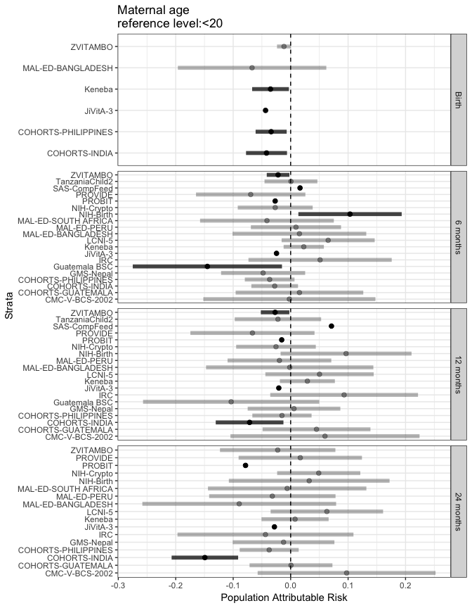<!-- -->  
  
#### Maternal BMI  
reference level: <=18.7   
<!-- -->  
  
#### Maternal height  
reference level: <=149.6   
<!-- -->  
  
#### Maternal parity  
reference level: 1   
<!-- -->  
  
#### Maternal weight  
reference level: <=42.4   
<!-- -->  
  
#### Mother is unmarried  
reference level: 0   
<!-- -->  
  
#### Mother's education  
reference level: Q1   
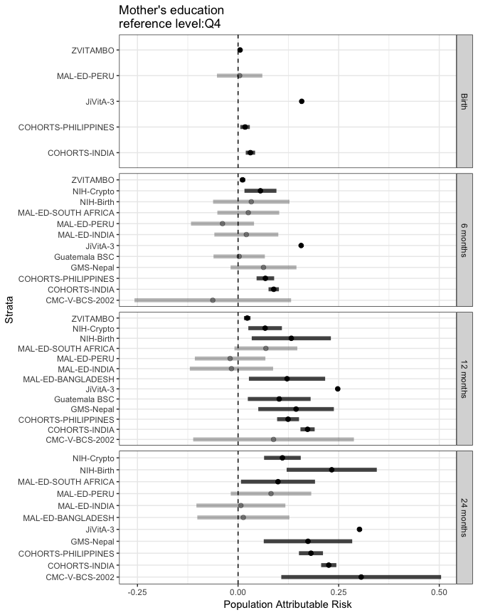<!-- -->  
  
  
### Paternal characteristics  
  
#### Father age  
reference level: <=24   
<!-- -->  
  
#### Father's education  
reference level: Q1   
<!-- -->  
  
  
  
## Point prevalence of stunting  
  
### Child characteristics  
  
#### Birth length  
reference level: <=46.8   
<!-- -->  
  
#### Birthweight  
reference level: <=2600   
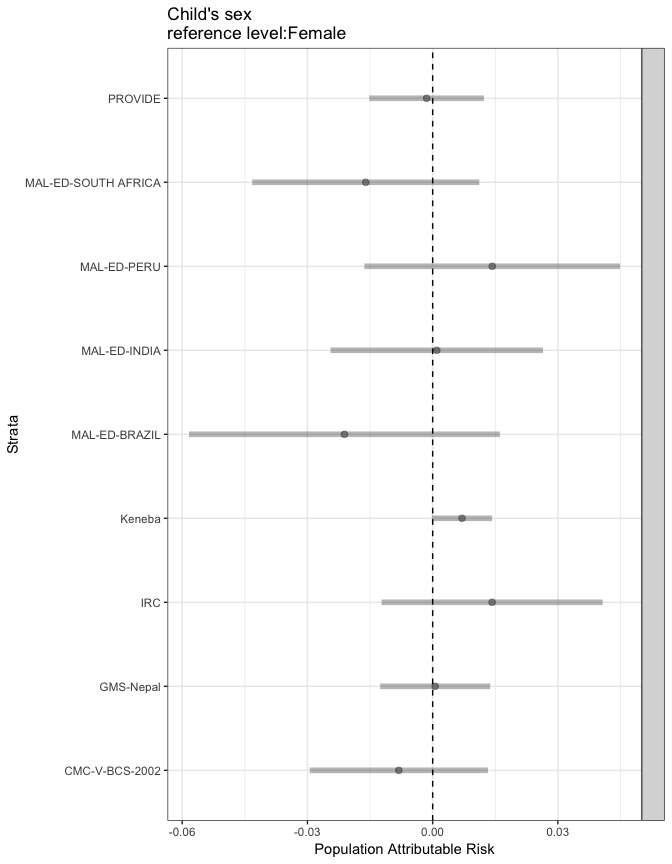<!-- -->  
  
#### Calendar month of birth  
reference level: 1   
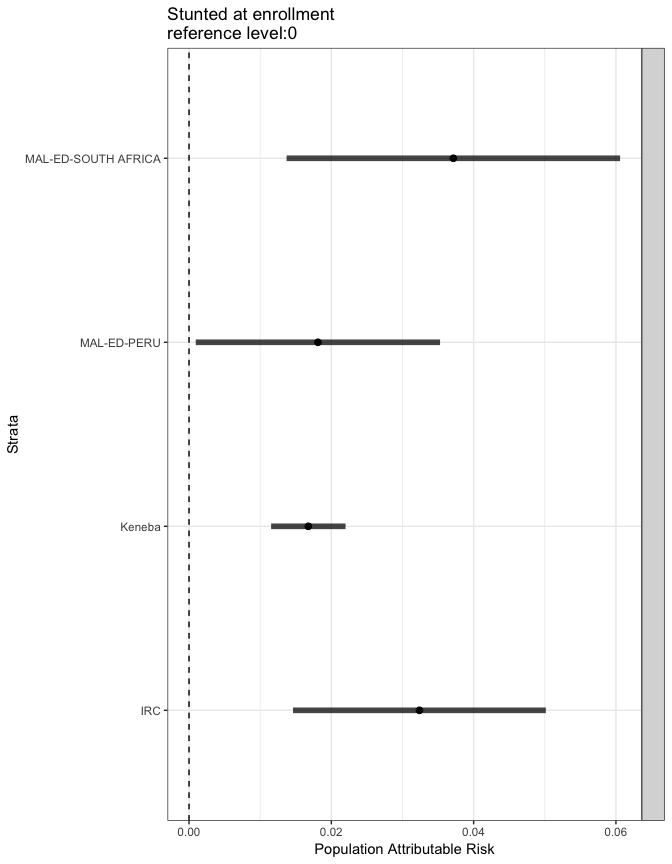<!-- -->  
  
#### Calendar month of measurement  
reference level: 1   
<!-- -->  
  
#### Child delivered at home  
reference level: 0   
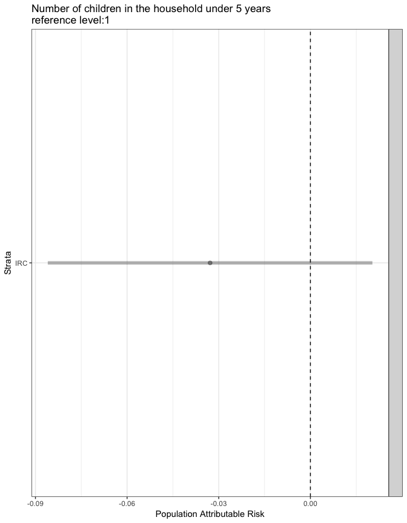<!-- -->  
  
#### Child's sex  
reference level: NA   
<!-- -->  
  
#### Stunted at enrollment  
reference level: 0   
<!-- -->  
  
#### Vaginal delivery  
reference level: 0   
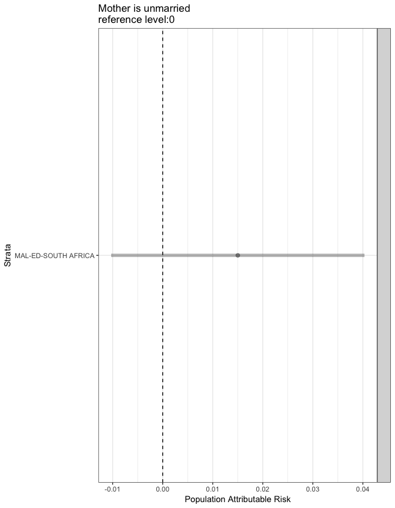<!-- -->  
  
  
### Household characteristics  
  
#### Asset based wealth index  
reference level: Wealth Q1   
<!-- -->  
  
#### nchldlt5  
reference level: 1   
<!-- -->  
  
#### nhh  
reference level: 3 or less   
<!-- -->  
  
#### Number of rooms in household  
reference level: 1   
<!-- -->  
  
#### USAID Household Food Insecurity Access Scale (HFIAS) category  
reference level: Food Secure   
<!-- -->  
  
  
### Maternal characteristics  
  
#### Gestational age at birth  
reference level: <=266   
<!-- -->  
  
#### Maternal age  
reference level: <=20   
<!-- -->  
  
#### Maternal BMI  
reference level: <=18.7   
<!-- -->  
  
#### Maternal height  
reference level: <=149.6   
<!-- -->  
  
#### Maternal parity  
reference level: 1   
<!-- -->  
  
#### Maternal weight  
reference level: <=42.4   
<!-- -->  
  
#### Mother is unmarried  
reference level: 0   
<!-- -->  
  
#### Mother's education  
reference level: Q1   
<!-- -->  
  
  
### Paternal characteristics  
  
#### Father age  
reference level: <=24   
<!-- -->  
  
#### Father height  
reference level: <=168   
<!-- -->  
  
#### Father's education  
reference level: Q1   
<!-- -->  
  
  

# Appendix 3 - Population Attributable Fraction Forest Plots

  
## Cumulative incidence of stunting from birth to 24 months  
  
### Child characteristics  
  
#### Birth length  
reference level: <=46.8   
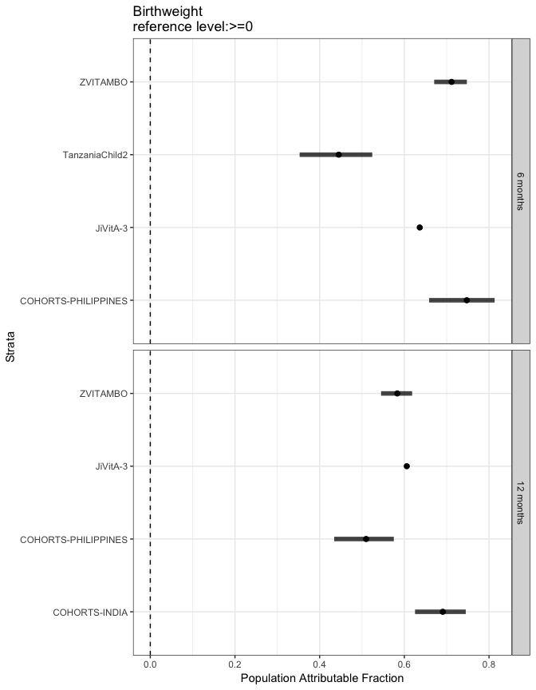<!-- -->  
  
#### Birthweight  
reference level: <=2600   
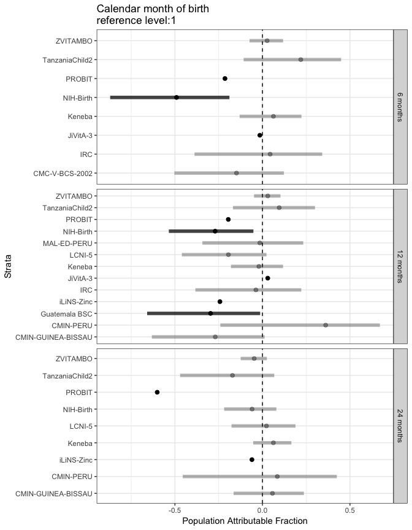<!-- -->  
  
#### Calendar month of birth  
reference level: 1   
<!-- -->  
  
#### Calendar month of measurement  
reference level: 1   
<!-- -->  
  
#### Child delivered at home  
reference level: 0   
<!-- -->  
  
#### Child's sex  
reference level: NA   
<!-- -->  
  
#### Stunted at enrollment  
reference level: 0   
<!-- -->  
  
#### Vaginal delivery  
reference level: 0   
<!-- -->  
  
  
### Household characteristics  
  
#### Asset based wealth index  
reference level: Wealth Q1   
<!-- -->  
  
#### nchldlt5  
reference level: 1   
<!-- -->  
  
#### nhh  
reference level: 3 or less   
<!-- -->  
  
#### Number of rooms in household  
reference level: 1   
<!-- -->  
  
#### USAID Household Food Insecurity Access Scale (HFIAS) category  
reference level: Food Secure   
<!-- -->  
  
  
### Maternal characteristics  
  
#### Gestational age at birth  
reference level: <=266   
<!-- -->  
  
#### Maternal age  
reference level: <=20   
<!-- -->  
  
#### Maternal BMI  
reference level: <=18.7   
<!-- -->  
  
#### Maternal height  
reference level: <=149.6   
<!-- -->  
  
#### Maternal parity  
reference level: 1   
<!-- -->  
  
#### Maternal weight  
reference level: <=42.4   
<!-- -->  
  
#### Mother is unmarried  
reference level: 0   
<!-- -->  
  
#### Mother's education  
reference level: Q1   
<!-- -->  
  
  
### Paternal characteristics  
  
#### Father age  
reference level: <=24   
<!-- -->  
  
#### Father's education  
reference level: Q1   
<!-- -->  
  
  
  
## Point prevalence of severe stunting  
  
### Child characteristics  
  
#### Birth length  
reference level: <=46.8   
<!-- -->  
  
#### Birthweight  
reference level: <=2600   
<!-- -->  
  
#### Calendar month of birth  
reference level: 1   
<!-- -->  
  
#### Calendar month of measurement  
reference level: 1   
<!-- -->  
  
#### Child delivered at home  
reference level: 0   
<!-- -->  
  
#### Child's sex  
reference level: NA   
<!-- -->  
  
#### Stunted at enrollment  
reference level: 0   
<!-- -->  
  
#### Vaginal delivery  
reference level: 0   
<!-- -->  
  
  
### Household characteristics  
  
#### Asset based wealth index  
reference level: Wealth Q1   
<!-- -->  
  
#### nchldlt5  
reference level: 1   
<!-- -->  
  
#### nhh  
reference level: 3 or less   
<!-- -->  
  
#### Number of rooms in household  
reference level: 1   
<!-- -->  
  
#### USAID Household Food Insecurity Access Scale (HFIAS) category  
reference level: Food Secure   
<!-- -->  
  
  
### Maternal characteristics  
  
#### Gestational age at birth  
reference level: <=266   
<!-- -->  
  
#### Maternal age  
reference level: <=20   
<!-- -->  
  
#### Maternal BMI  
reference level: <=18.7   
<!-- -->  
  
#### Maternal height  
reference level: <=149.6   
<!-- -->  
  
#### Maternal parity  
reference level: 1   
<!-- -->  
  
#### Maternal weight  
reference level: <=42.4   
<!-- -->  
  
#### Mother is unmarried  
reference level: 0   
<!-- -->  
  
#### Mother's education  
reference level: Q1   
<!-- -->  
  
  
### Paternal characteristics  
  
#### Father age  
reference level: <=24   
<!-- -->  
  
#### Father's education  
reference level: Q1   
<!-- -->  
  
  
  
## Point prevalence of stunting  
  
### Child characteristics  
  
#### Birth length  
reference level: <=46.8   
<!-- -->  
  
#### Birthweight  
reference level: <=2600   
<!-- -->  
  
#### Calendar month of birth  
reference level: 1   
<!-- -->  
  
#### Calendar month of measurement  
reference level: 1   
<!-- -->  
  
#### Child delivered at home  
reference level: 0   
<!-- -->  
  
#### Child's sex  
reference level: NA   
<!-- -->  
  
#### Stunted at enrollment  
reference level: 0   
<!-- -->  
  
#### Vaginal delivery  
reference level: 0   
<!-- -->  
  
  
### Household characteristics  
  
#### Asset based wealth index  
reference level: Wealth Q1   
<!-- -->  
  
#### nchldlt5  
reference level: 1   
<!-- -->  
  
#### nhh  
reference level: 3 or less   
<!-- -->  
  
#### Number of rooms in household  
reference level: 1   
<!-- -->  
  
#### USAID Household Food Insecurity Access Scale (HFIAS) category  
reference level: Food Secure   
<!-- -->  
  
  
### Maternal characteristics  
  
#### Gestational age at birth  
reference level: <=266   
<!-- -->  
  
#### Maternal age  
reference level: <=20   
<!-- -->  
  
#### Maternal BMI  
reference level: <=18.7   
<!-- -->  
  
#### Maternal height  
reference level: <=149.6   
<!-- -->  
  
#### Maternal parity  
reference level: 1   
<!-- -->  
  
#### Maternal weight  
reference level: <=42.4   
<!-- -->  
  
#### Mother is unmarried  
reference level: 0   
<!-- -->  
  
#### Mother's education  
reference level: Q1   
<!-- -->  
  
  
### Paternal characteristics  
  
#### Father age  
reference level: <=24   
<!-- -->  
  
#### Father height  
reference level: <=168   
<!-- -->  
  
#### Father's education  
reference level: Q1   
<!-- -->  
  
  
