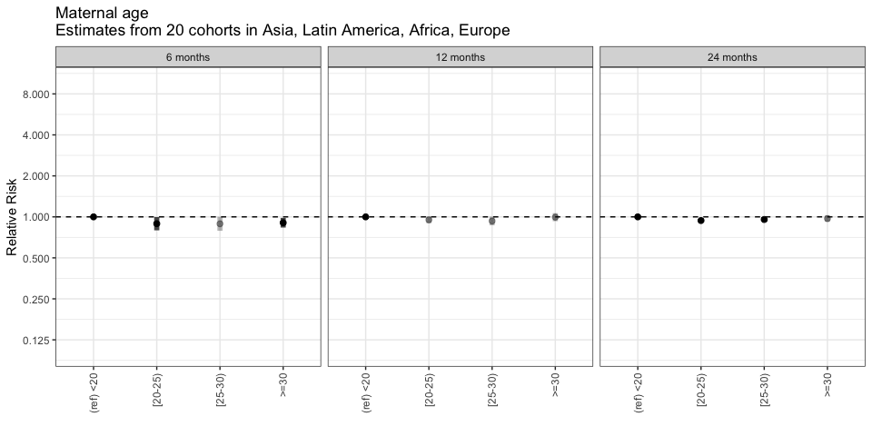

# Pooled Results

## Prevlanace of Stunting

  
### sex   
reference level: Female   
<!-- -->  
  
### gagebrth   
reference level: (266-273]   
<!-- -->  
  
### birthwt   
reference level: (2600-2970]   
<!-- -->  
  
### birthlen   
reference level: (46.8-48.8]   
<!-- -->  
  
### enstunt   
reference level: 0   
<!-- -->  
  
### vagbrth   
reference level: 0   
<!-- -->  
  
### hdlvry   
reference level: 0   
<!-- -->  
  
### mage   
reference level: (20-24]   
<!-- -->  
  
### mhtcm   
reference level: (149.6-154.9]   
<!-- -->  
  
### mwtkg   
reference level: (42.4-49.2]   
<!-- -->  
  
### mbmi   
reference level: (18.7-20.67]   
<!-- -->  
  
### single   
reference level: 0   
<!-- -->  
  
### fage   
reference level: (24-28]   
<!-- -->  
  
### fhtcm   
reference level: (168-173]   
<!-- -->  
  
### nrooms   
reference level: 1   
<!-- -->  
  
### nhh   
reference level: 3 or less   
<!-- -->  
  
### nchldlt5   
reference level: 0   
<!-- -->  
  
### hhwealth_quart   
reference level: Wealth Q1   
<!-- -->  
  
### month   
reference level: 1   
<!-- -->  
  
### brthmon   
reference level: 1   
<!-- -->  
  
### parity   
reference level: 1   
<!-- -->  
  
### meducyrs   
reference level: Q1   
<!-- -->  
  
### feducyrs   
reference level: Q1   
<!-- -->  
  
### hfoodsec   
reference level: Food Secure   
<!-- -->  

## Appendix 1 - Risk Factor Forest Plots

